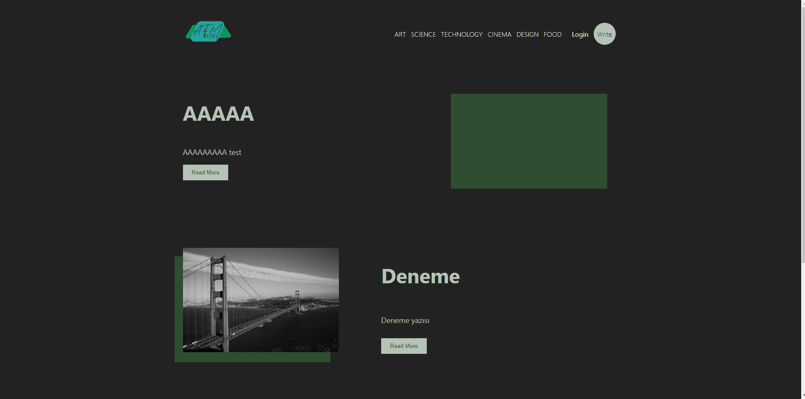
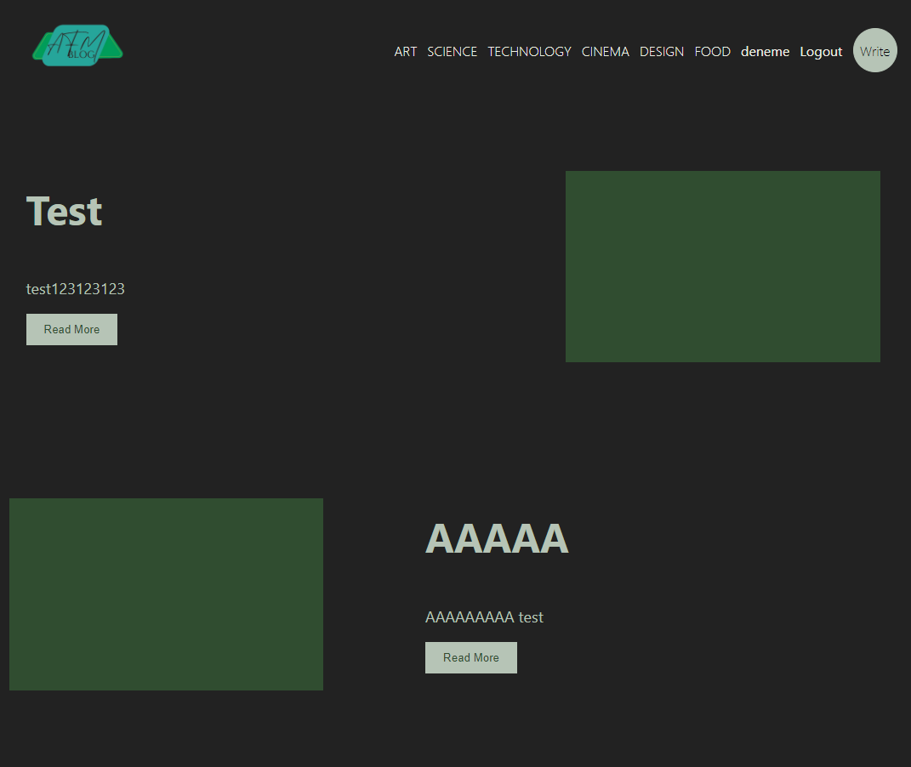
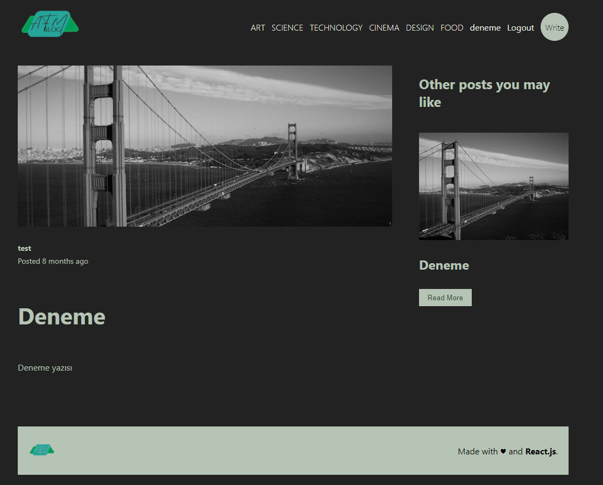
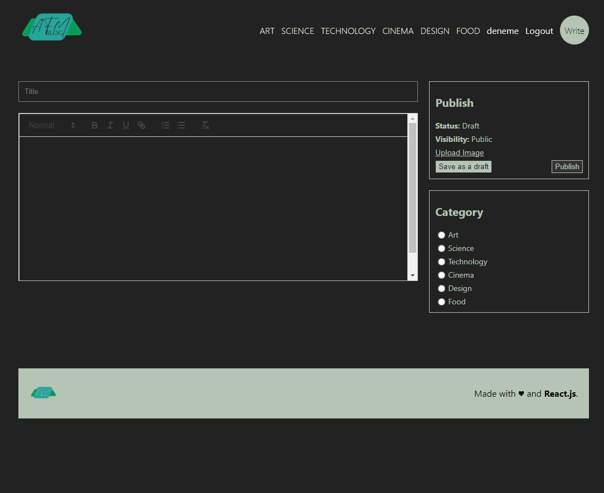

# Blog App

Blog page using React, React-Router-Dom, Express, MySQL and Authentication with JWT and Cookie

## Screenshots



---

- Home Page
  

- Single Post Page
  

- Write Page
  

## Installation

##### 1. Clone the project

```bash
git clone https://github.com/AhmetFM/blog-app.git
```

##### 2. Navigate to the project directory:

```bash
cd blog-app
```

##### 3. Open 2 terminal for each folder and install the dependencies:

```bash
cd api
npm install
```

```bash
cd client
npm install
```

##### 4. Set up MySQL and connection values:

- Connect to mysql by changing the values ​​in the db.js file in the api folder

- Add the necessary environment variables as per the .env.example file.

##### 5. Start the development server for each terminal:

```bash
cd api
npm start
```

```bash
cd client
npm run dev
```

```bash
cd socket
npm start
```

## Technologies Used

- Frontend: React, Context API, React-Router-Dom, SASS
- Backend: Node.js, Express
- Database: MySQL
- Authentication: JWT, Cookie

## License

[MIT](LICENSE)
